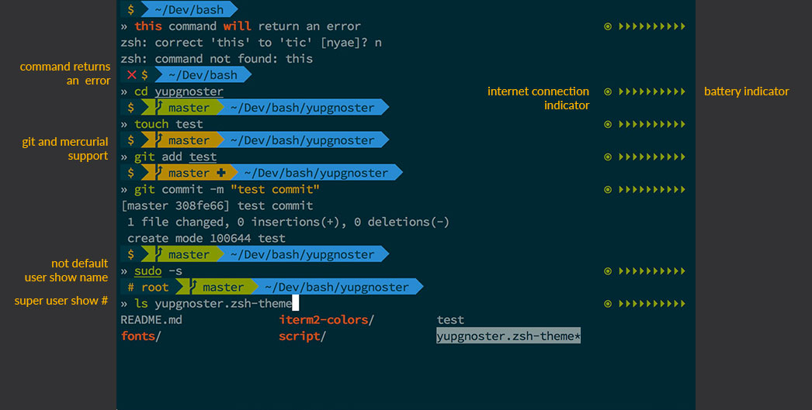

# yupgnoster
Antigen ZSH Theme

**Based on Agnoster-refresh**<br/>
https://github.com/fusion94/Agnoster-refresh<br/>
**Which was based on Agnoster**<br/>
https://github.com/robbyrussell/oh-my-zsh/blob/master/themes/agnoster.zsh-theme



### License
Licensed under a [Creative Commons Attribution-NonCommercial-ShareAlike 4.0 International License](http://creativecommons.org/licenses/by-nc-sa/4.0/).

## What you need

1. You need to have Antigen or zplug installed with `git` plugin (to use this theme see below)

2. You need also to have a Powerline Font (SauceCodePro is provided in the fonts directory) installed on your machine and set your terminal to use it
You can find a lot more here https://github.com/powerline/fonts

3. Finally you can use a terminal color scheme: I am using SolarizeDark, you can find this scheme for different terminals here https://github.com/altercation/solarized
 

## zplug use
Run this command in your .zshrc
```
zplug "yupswing/yupgnoster", as:theme
```

## Antigen use
Run this command or put in your .zshrc 
```
antigen theme https://github.com/yupswing/yupgnoster.git yupgnoster
```


## Extra features

#### Battery
**ONLY MAC** If you want to show battery charge run this command<br/>
````
sudo cp script/battery-check/batcharge.py /usr/local/bin/
````

To disable it just run <br/>
````
sudo rm /usr/local/bin/batcharge.py
````

#### Internet connection<br/>
If you want to show internet connectivity (red/green dot) run this command (for Mac, in Linux just create a cronjob with 60 seconds interval)<br/>
````
sudo cp script/online-check/online-check.sh /usr/local/bin/online-check.sh &&
sudo cp script/online-check/com.akifox.yupgnoster.online-check.plist ~/Library/LaunchAgents &&
launchctl load -w ~/Library/LaunchAgents/com.akifox.yupgnoster.online-check.plist
````

To disable it just run<br/>
````
launchctl unload -w ~/Library/LaunchAgents/com.akifox.yupgnoster.online-check.plist &&
sudo rm ~/Library/LaunchAgents/com.akifox.yupgnoster.online-check.plist
````
